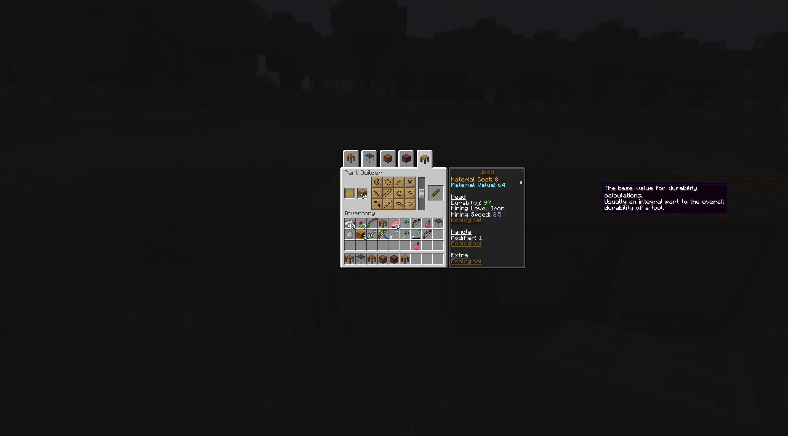
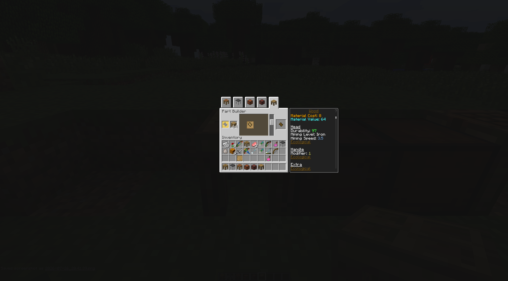
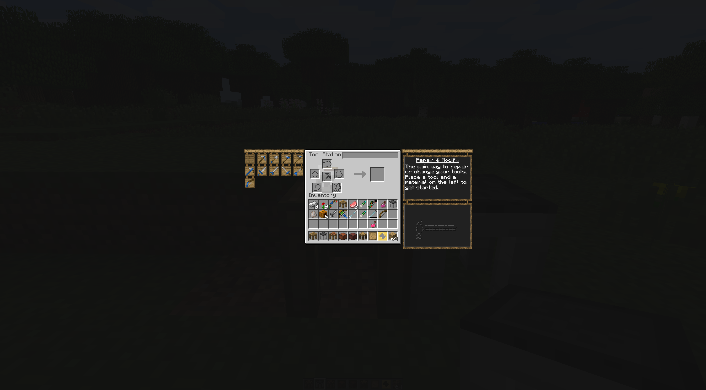
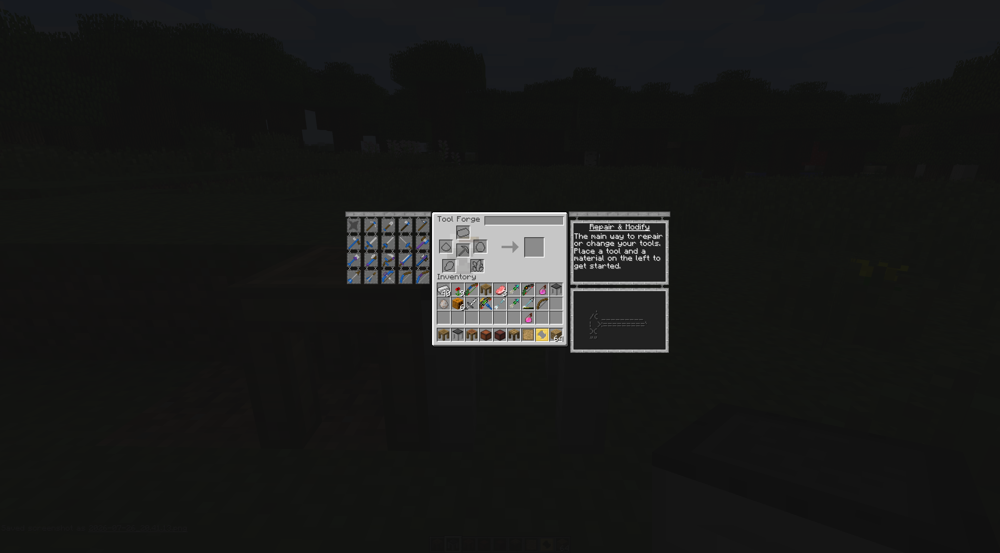
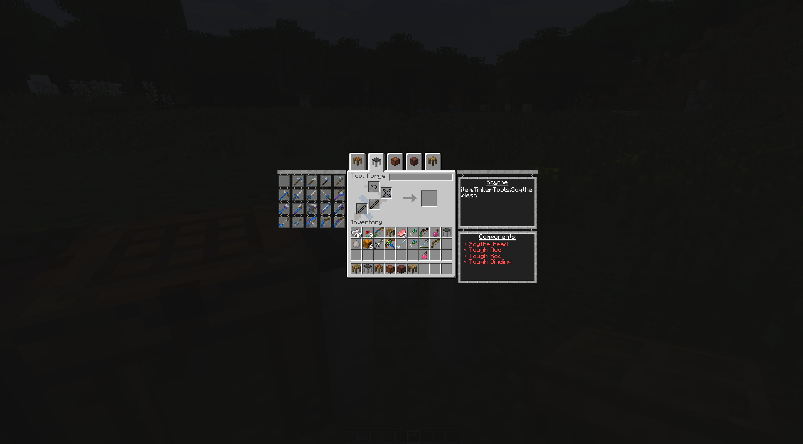
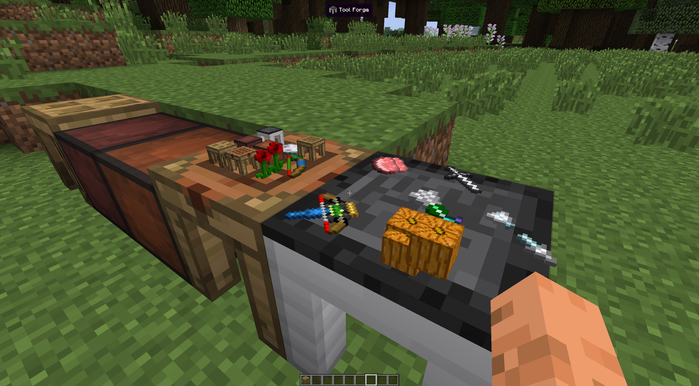
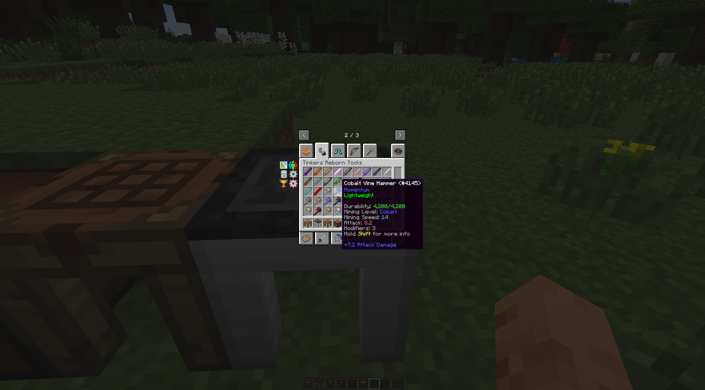

# Tinkers Reborn

    Make Tinkers Great again
**Still WIP!** have many issues

## NBT

```json

"TinkersRebornTool":{
  // actual render materials identifier in order
  "RenderMaterials":["wood", "wood", "obsidian"],
  // materials identifier in order READONLY
  "Materials":["iron", "wood", "obsidian"],
  // TODO
  "Modifiers":[
    {
      "identifier":"haste",
      "color":9502720,
      "type":"modify"
    },
    {
      "identifier":"ecological",
      "color":-7444965,
      "type":"trait"
    }
  ],
  // this tool's now stats
  "Stats":{
    "Durability": 1,
    "Attack": 2.1,
    "MiningSpeed": 2.2,
    "HarvestLevel": 3,
    "ModifierSlots": 3, // this never change
    "ExtraModifiers": 10, // this add by modifier/trait/level up
    "UsedModifiers": 0
  },
  // this tool's base stats READONLY
  "StatsOriginal":{
    "Durability": 0.5,
    "Attack": 2.1,
    "MiningSpeed": 1.0,
    "HarvestLevel": 3,
    "ModifierSlots": 3,
    "ExtraModifiers": 0,
    "UsedModifiers": 0
  },
  // for some traits data
  "Special":{
    "alien":{
      "pool":{
        "durability":282,
        "attack":1.349999,
        "speed":1.7359989
      },
      "bonus":{
        "durability":19,
        "attack":0.110000014,
        "speed":0.14
      }
    }
  },
  "CategoryList": ["harvest", "tool"],
  // 1 broken, 0 not broken, use boolean
  "Broken":0,
  "Unbreakable":1,
  "RepairCount":10
}
```

## Some features



no more **Stencil Table**, good



use pattern can craft every part but will consume pattern

use cast can only craft specified parts and will not consume the cast



looks like TiC2, I like it







these blocks will render the item stack inside it's container



colorful tooltips and some new tools from higher version

## TOOL and WEAPON

### Pickaxe

  not special

### Shovel

  damage * 0.9

### Hatchet

  knock back * 1.3

  damage * 1.1

  base damage + 0.5

  breaking leaves does not reduce durability

### Mattock

  mining speed * 0.95

  damage * 0.9

  knock back * 1.1

  base damage + 3
  
  use like hoe

### Kama

  harvest crop then replant them

  work as scissors

### Hammer

  mining speed * 0.4

  damage * 1.2

  extra [3,7) damage to UNDEAD

  Durability * 2.5

  use hammer head's material fix can get 2.5x durability, large plate's material can fix 1.5x

### Excavator

  mining speed * 0.28

  damage * 1.25

  Durability * 1.75

  use excavator head's material fix can get 1.75x durability, large plate's material can fix 1.3125x

### LumberAxe

  mining speed * 0.35

  damage * 1.2

  knock back * 1.5

  base damage + 2

  chop the whole tree

### Scythe

  Durability * 2.2

  like Kama but have aoe(have some bug...)
  
  may need balance

### BroadSword

  Durability * 1.5

  sweep damage to entity near by target

  base damage + 1

### LongSword

  Durability * 1.05

  damage cutoff over 18

  damage * 1.1

  base damage + 0.5

  rush

### Rapier

  Durability * 0.8

  damage * 0.55

  damage cutoff over 13

  knock back * 0.6

  half damage will by pass armor

### Cleaver

  Durability * 2

  damage * 1.2

  damage cutoff over 25

  use large blade's material fix can get 2x durability, large plate's material can fix 1.5x

  (base damage * 1.3) + 3

  (ModBeheading have some issue wait to fix)

### Vine Hammer

  mining speed * 0.4

  damage * 1.2

  base damage + 3

  Durability * 2.5

  can mine connected ores (default up limit is 25 each time)

### Arrow

  base damage + 2

### Short Bow

  draw time 12

  slow down 50%

  damage = (arrow damage + 1) * 0.8 + bonusDamage

  base accuracy 100%

### Long Bow

  draw time 30

  slow down like vanilla bow

  arrow speed 5.5x

  damage = (arrow damage + 2.5) * 1.25 + bonusDamage

  zoom in 60%

  base accuracy 120%

  durability * 1.4

### Bolt

  durability * 0.8

  half damage will by pass armor

### Cross Bow

  draw time 45

  slow down to 19.5%

  arrow speed 7x
  
  bonusDamage * 1.5

  damage = (arrow damage + 3) * 1.3 + bonusDamage
